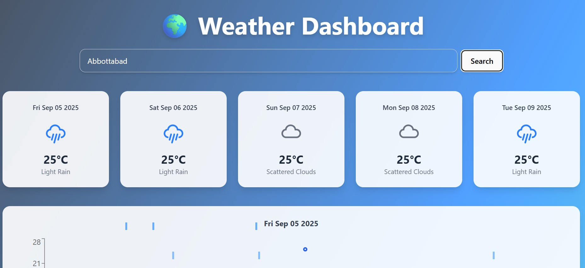

# 🌦️ Weather Dashboard

A responsive **Weather Dashboard** built with **React, Vite, Tailwind CSS**, and **Recharts**.  
It fetches live weather data using the **OpenWeather API** and displays current and future forecasts in an interactive way.

---

## ✨ Features

- 🌍 **Live Weather Data** using OpenWeather API  
- 📊 **Interactive Graphs** (Temperature trends, etc.)  
- ⛅ Dynamic **Icons** for Sun, Rain, and Clouds  
- 🌳 Simple and clean **UI with Trees & Home visuals**  
- 📅 **5-Day Weather Forecast**  
- 📱 Fully **Responsive Design** with Tailwind CSS  

---

## 🛠️ Tech Stack

- ⚡ **Vite** – Fast build tool  
- ⚛️ **React** – UI library  
- 🎨 **Tailwind CSS** – Styling  
- 📊 **Recharts** – Graphs and Charts  
- 🌦️ **OpenWeather API** – Weather Data  

---

## 📂 Project Structure

weather-dashboard/

│── src/

│ ├── components/ # Reusable UI Components

│ ├── App.jsx # Main App

│ ├── index.css # Tailwind Styles

│ └── main.jsx # Entry Point
│
│── public/ # Static files

│── images/ # Screenshots (image.png, image1.png)

│── package.json

│── vite.config.js

│── README.md

yaml
Copy code

---

## 🚀 Installation & Setup

1. **Clone the repo**
   ```bash
   
   git clone https://github.com/your-username/weather-dashboard.git
   
   cd weather-dashboard
Install dependencies

bash
Copy code
npm install
Add your OpenWeather API key
Create a .env file in the root and add:

env
Copy code
VITE_WEATHER_API_KEY=your_api_key_here
Run the project

bash
Copy code
npm run dev
📈 Usage – Graphs & Charts
The temperature line chart shows the daily temperature trend for the next 5 days.

X-Axis → Represents Date / Time

Y-Axis → Represents Temperature (°C)

Line Graph → Displays the fluctuation of temperature (minimum & maximum)

Tooltips appear when hovering, giving exact temperature values for each day.

This helps you visualize weather patterns at a glance.

## 📸 Screenshots

Here are some screenshots of the Weather Dashboard in action:

- **Dashboard View**  
  

- **5-Day Forecast**  
  
  

📌 Future Improvements

🌍 Add location search bar for multiple cities

🎨 Dark / Light mode

🗺️ Interactive Map with weather layers

